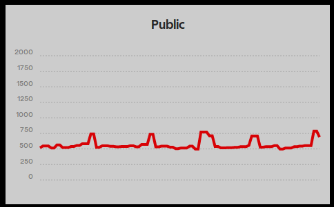

# dashbi-widget-chart

Dashbi widget that displays chart using [chartist.js](https://gionkunz.github.io/chartist-js/)



## Usage

### Install

```sh
npm install --save dashbi-widget-chart
```

### Register

Dashbi should detect and auto-register widget.

### Configuration

Name | Type | Description
--- | --- | ---
`type` | String | Type of chart. Options: `Line`, `Bar`, `Chart`
`useStateKey` | String | Which state key should be used for data presentation
`options` | Object | Additional chartist.js options

### Example

Lets' say that `some-data-provider` provides state which has key `randomNumber`:

```js
dashbiLayout.addWidget({
  name: 'chart',
  title: 'My Line Chart',
  params: {
    type: 'Line',
    useStateKey: 'randomNumber',
    options: {
      low: 0,
      hight: 1000
    }
  },
  source: {
    name: 'some-data-provider'
  }
});
```
